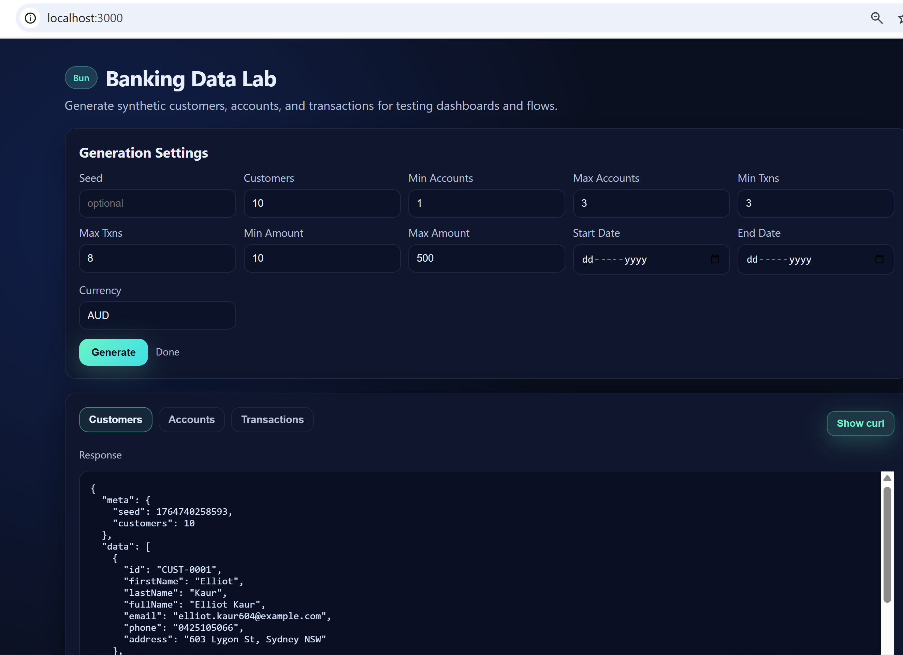

# DataGen API (Bun)

**Simple tool built on the Bun runtime to see how cool Bun really is.**
Learn more about Bun here: https://bun.com/docs

**This tool exposes REST endpoints ([API Docs](/api-docs.html)) to easily consume and generate data programmatically (e.g., seed test frameworks before runs).**

Lightweight HTTP API that produces synthetic data (customers, accounts, transactions, and more) for testing dashboards or integrations. Location-aware data keeps phone numbers, addresses, and postal codes consistent with the selected country and state.

## UI preview



## Run the API

```bash
bun run index.ts
# or specify a port
PORT=4000 bun run index.ts
```

## Endpoints

- `GET /health` readiness check.
- `GET /customers` list of generated customers.
- `GET /accounts` customers plus their generated accounts.
- `GET /transactions` customers, accounts, and transactions.

All endpoints accept the same query params:

| Param | Default | Notes |
| --- | --- | --- |
| `country` | `australia` | One of `australia`, `india`, `united-kingdom`/`uk`, `united-states`/`usa` |
| `state` | random for selected country | Match a state key for the chosen country (e.g. `vic`, `karnataka`, `england`, `california`) |
| `emailDomains` | `example.com` | Comma-separated domains for emails; invalid domains are ignored; one is picked per customer |
| `format` | `json` | Response format: `json`, `yaml`, or `xml` (or send `Accept: application/xml` / `application/x-yaml`) |
| `seed` | current timestamp | Set for deterministic runs |
| `customers` | `10` | Number of customers |
| `minAccounts` | `1` | Min accounts per customer |
| `maxAccounts` | `3` | Max accounts per customer |
| `minTransactions` | `3` | Min transactions per account |
| `maxTransactions` | `8` | Max transactions per account |
| `currency` | country default (AUD/INR/GBP/USD) | Override if you want a different currency |
| `minAmount` | `10` | Min transaction amount |
| `maxAmount` | `500` | Max transaction amount |
| `startDate` | 1 month ago | ISO date (inclusive) |
| `endDate` | now | ISO date (inclusive) |

The customer payload now includes country, state, city, postal code, and localized phone/mobile formats to match the selected territory.

## Example requests

```bash
# Default dataset
curl "http://localhost:3000/transactions"

# Deterministic dataset with tighter ranges
curl "http://localhost:3000/transactions?seed=42&customers=5&minAccounts=1&maxAccounts=2&minTransactions=2&maxTransactions=4&minAmount=5&maxAmount=120&startDate=2024-01-01&endDate=2024-02-01"

# Customers only (India / Karnataka, INR)
curl "http://localhost:3000/customers?seed=99&customers=3&country=india&state=karnataka&currency=INR"
```

Responses include a `meta` block describing the generation config and a `data` block with the generated objects.
